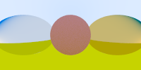

# Ray tracing

 

Implementation of the excelent book [Ray Tracing in one weekend](https://raytracing.github.io/books/RayTracingInOneWeekend.html)

### Running
```sh
# With the rust toolchaing installed, Clone the repository and run:
cargo run
# result will be in result.bmp
```

### Notable differences
- Rust!
- Results are in bmp and not in ppm as I had some problems with displaying the lesser known format.
- Bugs! 🎷🐛
